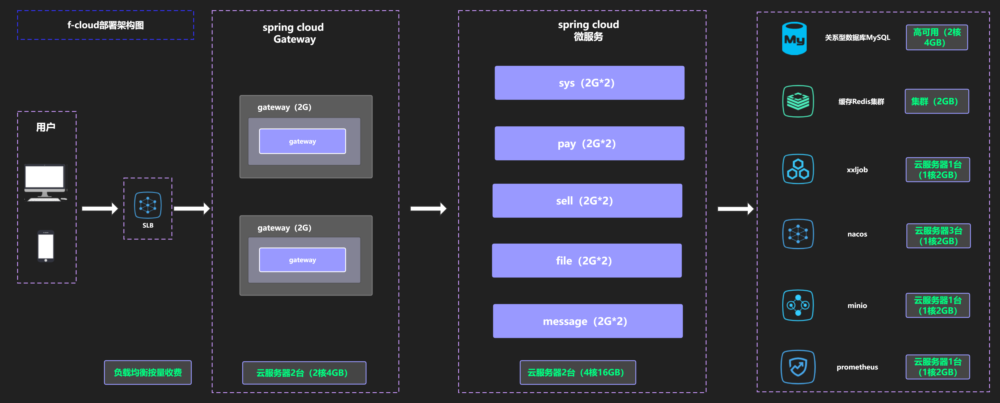

# f-cloud

### 部署架构图

### 介绍
简单、高效的SpringCloud前后端分离项目

### 使用技术
- spring boot 2.6
- spring cloud alibaba
- spring cloud Gateway
- nacos 
- seata
- sentinel
- jwt
- mybatis-plus
- redis
- jetcache
- validation
- mapstruct
- disruptor
- minIO

### 软件架构
- api 实体和基础类定义
- client feign接口
- common 公共模块（工具类等）
- service 微服务
- gateway 网关
- generator 代码生成

### 使用端口
- gateway 8000
- file 18082
- message 18081
- pay 18085
- sell 18083
- sys 18080

### 集成前端项目

- <a target="_blank" href="https://gitee.com/realmadridlf/f-vue-cloud.git">f-vue-cloud</a>

### 安装教程
- 执行doc/sql目录下的脚本初始化数据库表结构
- 启动nacos、并导入doc/nacos配置
- 启动redis、mysql服务
- 启动minio服务`【非必须】`
- 启动service、gateway

### 使用说明
- 暂无

